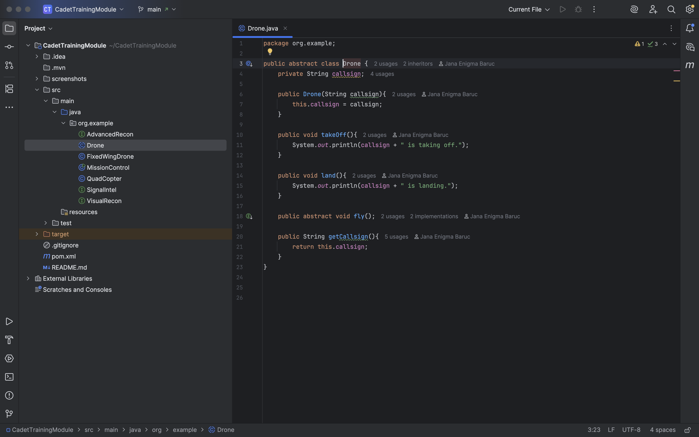
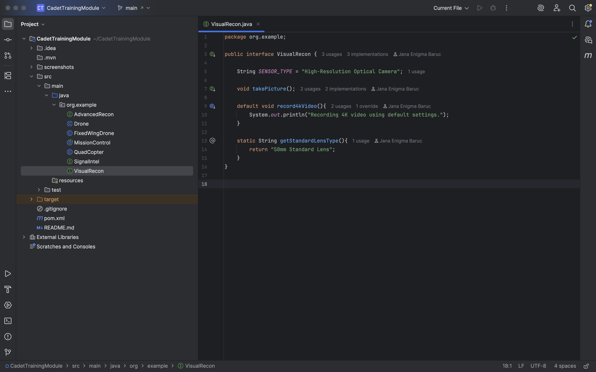
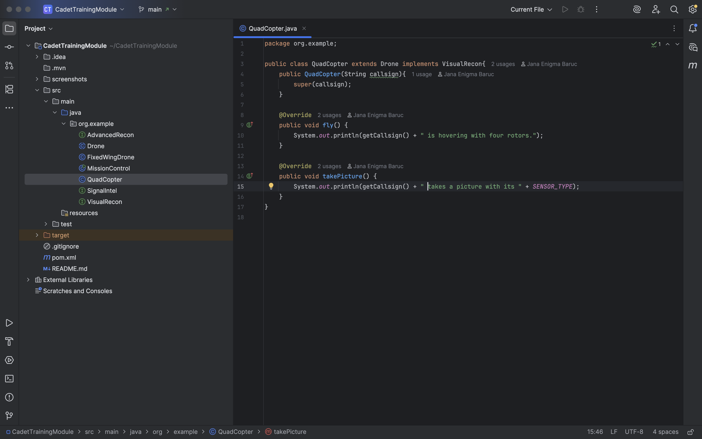
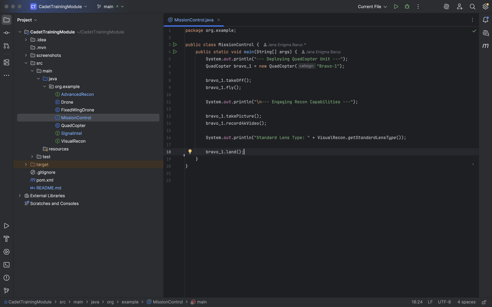
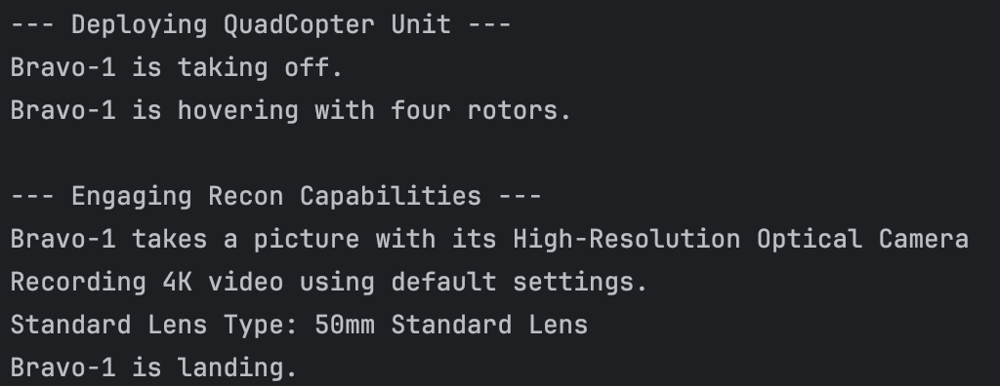
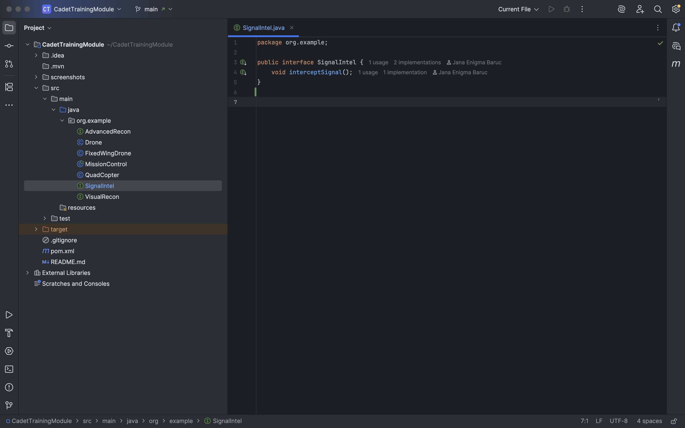
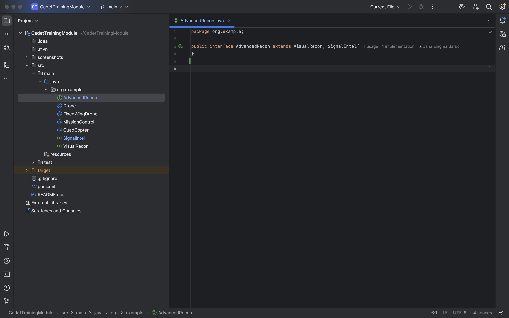
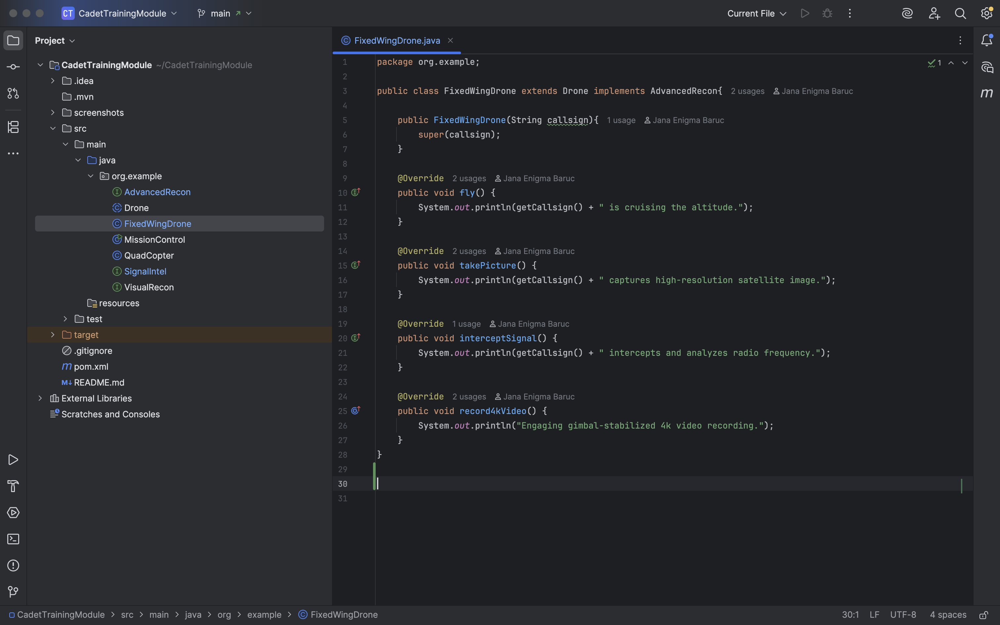
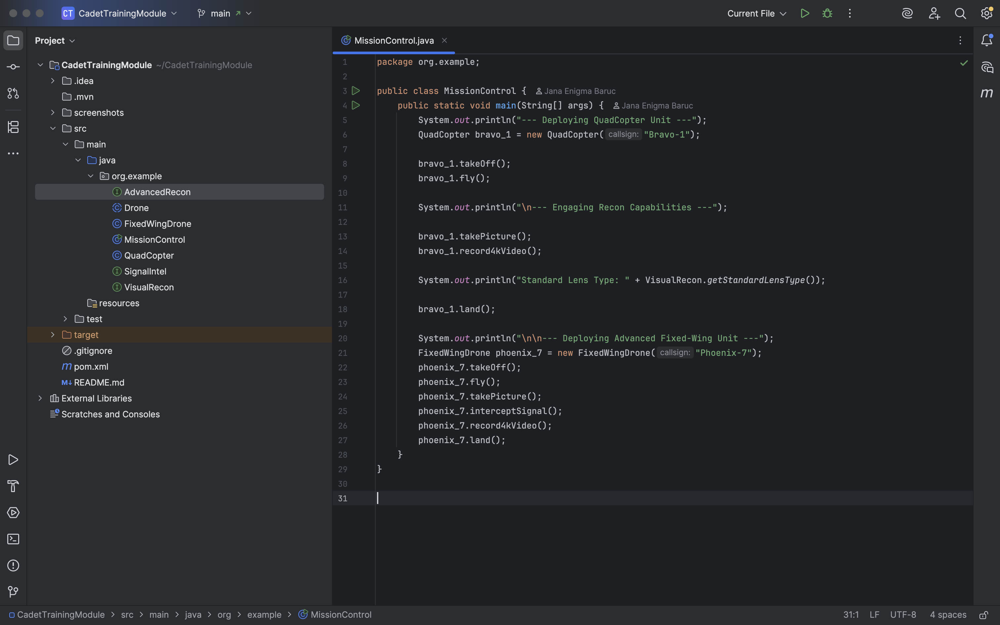
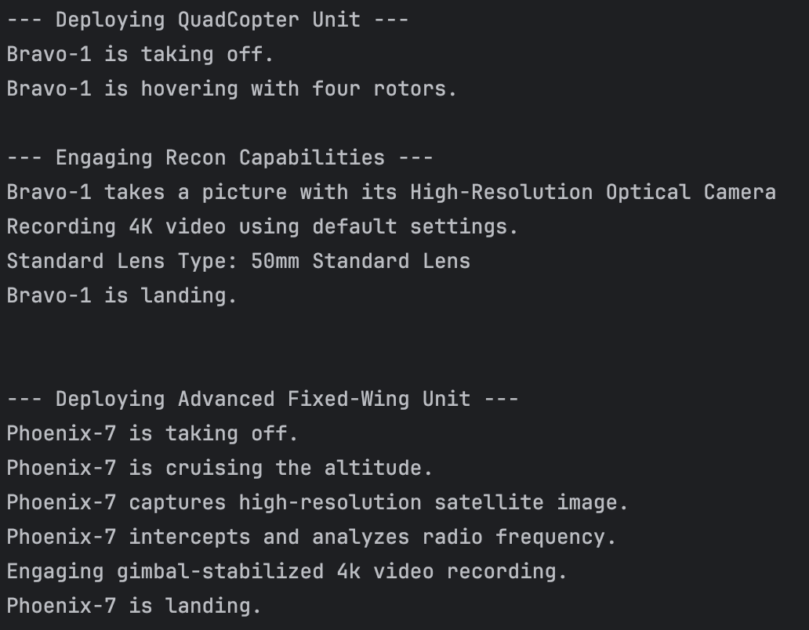

# Cadet Training Module: Java Inheritance and Interfaces
Submitted by: Baruc, Jana Enigma S.

## Section 1: The Foundation - The `Drone` Abstract Class 
### Drone.java

## Section 2: Defining a Capability - The `VisualRecon` Interface
### VisualRecon.java

## Section 3: The First Unit - Implementing the `QuadCopter`
### QuadCopter.java

## Section 4: The Mission Control and Execution
### MissionControl.java

### Output

## Section 5: Expanding Capabilities by Extending Interfaces
### SignalIntel.java

### AdvancedRecon.java

## Section 6: Deploying an Advanced Drone
### FixedWingDrone.java

### MissionControl.java (updated)

### Complete Output
